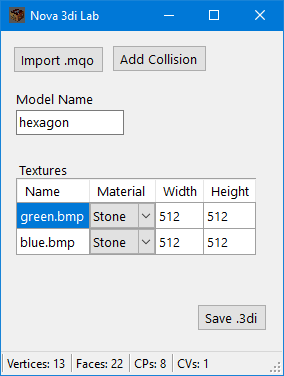

# Nova 3di Lab

Nova 3di Lab is a .NET desktop app and library for creating and modifying .3di files.
3di files are static 3D models used by Novalogic video games.
Delta Force 2 is currently the only supported game.

## Desktop App

The desktop app allows you to convert metasequoia (.mqo) files to Delta Force 2 models.

